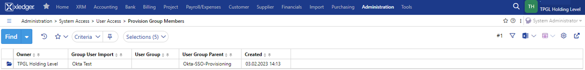

# Configure SCIM Provisioning between Xledger and Okta
Xledgers app in Okta enables you to use SSO as your method of authentication and SCIM as your method of provisioning.

## Supported Features:
-	Push Users. Users in Okta that are assigned to the Xledger application in Okta are automatically created as users in Xledger
-	Update User Attributes. When user attributes are updated in Okta, they will be updated in Xledger
-	Deactivate Users. When users are deactivated in Okta, they will be ‘locked’ in Xledger which prevents login
-	Push Groups. Groups and their user memberships in Okta can be pushed or updated to Xledger

## Requirements:
-	Access to assign users to Xledger App in Okta
-	SSO is set up for Okta in Xledger (see help section SSO Okta- Xledger)
-	Domain Administrator role in Xledger to access login configurations
-	SCIM-based user provisioning in Xledger is currently available for all customers

## Configuration Steps:
-	Copy the SCIM token in Xledger from **Administration > System Access > Api Access Tokens** \

-	Add the integration in Okta. In Applications > Applications, click Browse App Catalog and search for Xledger
-	Go to Provisioning tab:
(For customers with access to our demo environment that wish to test the solution first, 	please refer to help section/document [Configure SSO between Xledger and Okta](https://github.com/xledger/xledger_external_documentation/blob/master/app_provisioning/configure_sso_between_xledger_and_okta.md) – Configuration Steps (3))
-	Enter API Token credentials and Test Api Credentials: \

## Attributes and Mapping

## Troubleshooting and Tips
- User Onboarding requirements \
Xledger Provisioning is a group/role based solution where the SCIM group membership and Xledger role setup is required for the user to be fully onboarded in our system. Without this requirement the user will be imported but not onboarded with a role and login.

## Get Started- Quick Setup Guide

1. Create a User Group in Xledger
Go to **Administration > System Access > User Access > User Group**
1. Set up a role in Xledger 
Go to **Administration > System Access > User Access > Group Menu Access**
1. In Okta, link the Xledger group with an Okta group and assign a user to the Okta group 
1. User is provisioned in Xledger, results:
- Go to **Administration > System Access > User Access > Provision User Import** to see the created user 
- Go to **Administration > System Access > User Access > Provision Group Members**  to see that group membership was updated
- Go to **Administration > System Access > Users > Local Access** to see that a role was assigned to the user 
5. Test that the user can log on in Okta, chose the Xledger app and access the application with the correct role

## Detail Guide to Provisioning
1. Provisioning of existing users \
On user creation in Xledger we match the Okta username against Xledger user email. For existing users this will link the users otherwise a new user is created. \
To avoid duplicates for existing users in Xledger, make sure that the username and email matches. In Xledger, go to **Administration > System Access > Users > Local Users** \
Make sure the email is set to the username attribute.

2. Provisioning Groups \
Create groups in Okta and push groups (with or without group membership) \
 \
Group with user memberships is pushed to Xledger: \
 \
Please note: as the token is established on holding level, the group will also be imported on holding level (TPGL Holding in this example)

3. Role Setup in Xledger \
setting  up the role in Xledger  **(Group Menu Access)** \
 \
Please note: even though the group was imported on holding level, the link to the role must be established on the the level the role should be assigned. In this example, the group is linked to role Accountant on entity TPGL1, which is a sub entity of TPGL Holding group.

4. Onboarding a user \
To provision users, assign users in Okta to a group \
The onboarding procedure is triggered when that user membership is pushed to a group that is assigned a role in Xledger

- in Okta: \
click the Assignments tab of the Xledger app \
select assign, then Groups. Select the group you'd like to assign to. \
In our example, the group is Okta SSO Provisioning \

- in Xledger: \
Provisioned users can be seen in the **Administration > System Access > User Access > Provision User Import** screen. When users have been onboarded they will receive a User ID which is a reference to Local Users and an SSO login. The user will be marked if an **Employee register** for the user exists. \

5. Consistency Check Job \
The group role can be setup after the group and membership are pushed. If this is the case please run this job to onboard users with roles: **Administration > System Access > User Access > Consistency Check** \

6. Offboarding a User \
Unassigning from group will terminate roles in Xledger \
 \
Deleting a group in Okta will have same effect as removing a user from the group. \
Deactivating a user or unassigning a user from the Xledger app in Okta will terminate roles and user will be locked in user provisioning table. \
 \

7. Errors in Provisioning \
 \
If there is a delay or error in Provisioning, please refer to relevant Okta documentation
