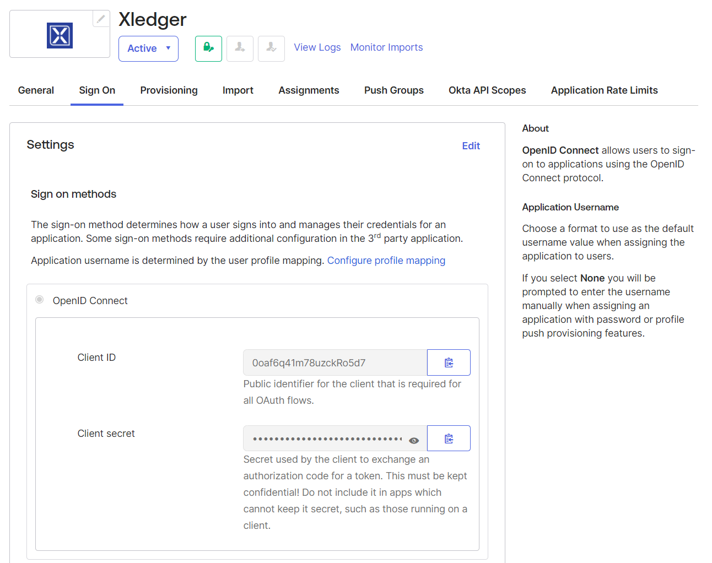
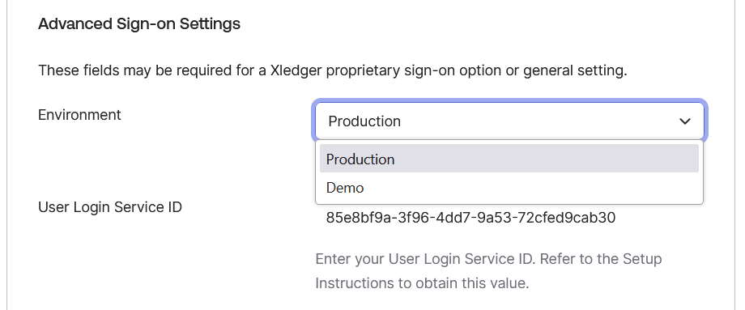
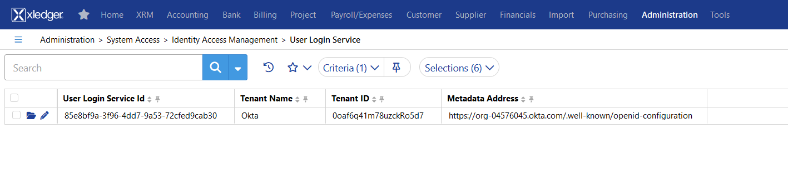
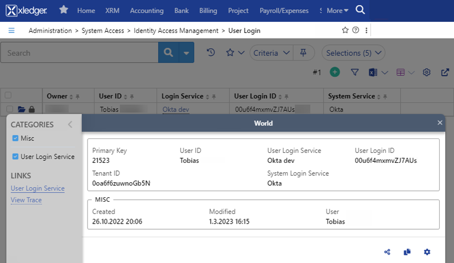

# Configure SSO between Xledger and Okta

## Contents

- Supported features
- Requirements
- Configuration steps

## Supported features

- Single Sign-On (OpenID Connect) initiated via Okta
- Provisioning or manual

## Configuration steps
We need to setup the User Login Service in Xledger based on some information from Okta.

1.	In Applications > Applications, click Browse App Catalog and search for Xledger. Add the integration

2.	In Sign-On tab , click edit and copy the Client ID: \

3.	Chose Environment and paste Client ID here (Demo can be selected for customers with access to our demo environment that wish to test the solution first) \

4.	In a browser from your okta tab, copy the company specific url (in this example dev-0555.okta.com and navigate to Okta login site from a new tab) \

5.	**In Xledger go to Administration > System Access > Identity Access Management > User Login Service** \
-	enter Oktas client ID from point 2 as tenant ID
-	client secret as tenant secret
-	enter company specific url as metadata address, add suffix /.well-known/openid-configuration \

6.	For new users created by provisioning this step can be skipped (user login is created automatically if User Login Service is setup) \
Get the Okta userId: \
It can be found by going to the profile in Okta and checking the URL - …/user/profile/view/ 00u6f4mxmvZJAUs

7.    Go to  **Administration > System Access > Identity Access Management > User Login** \
Enter Oktas user ID as User login ID and the previously created User Login Service as User Login Service \
 \
Okta users assigned to the Xledger App should now be signed in by clicking the app under My Apps in Okta.