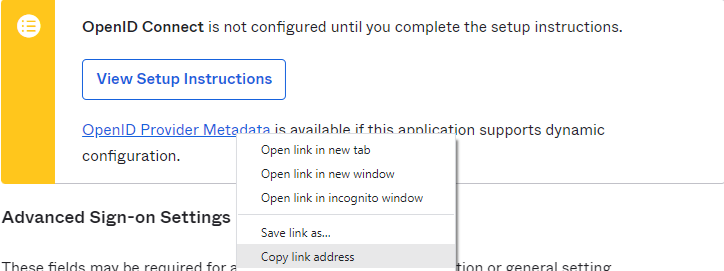

# Configure SSO between Xledger and Okta

## Contents

- Supported features
- Requirements
- Configuration steps

## Supported features

- Single Sign-On (OpenID Connect) initiated via Okta
- Provisioning or manual

## Configuration steps
We need to setup the User Login Service in Xledger based on some information from Okta.

1.	In Applications > Applications, click Browse App Catalog and search for Xledger. Add the integration

2.	In Sign-On tab , click edit and copy the Client ID: \

3.	Fill out advanced sign-on settings and credentials details: \
 \
Choose environment "Production" or "Demo" (Demo can be selected for customers with access to our demo environment that wish to test the solution first). \
Right under, you and paste Client ID obtained in the previous step. \
Under credentials details you can specify email (=format username in Xledger) if your Okta settings have a different username format.

4.	Get metadata url by copying the link from the sign-on tab as illustrated here: \

5.	**In Xledger go to Administration > System Access > Identity Access Management > User Login Service**
-	enter Oktas client ID from point 2 as tenant ID
-	client secret as tenant secret
-	enter metadata url as metadata address \

6.	For new users created by provisioning this step can be skipped (user login is created automatically if User Login Service is setup) \
Get the Okta userId: \
It can be found by going to the profile in Okta and checking the URL - …/user/profile/view/ 00u6f4mxmvZJAUs

7.    Go to  **Administration > System Access > Identity Access Management > User Login** \
Enter Oktas user ID as User login ID and the previously created User Login Service as User Login Service \
 \
Okta users assigned to the Xledger App should now be signed in by clicking the app under My Apps in Okta.
