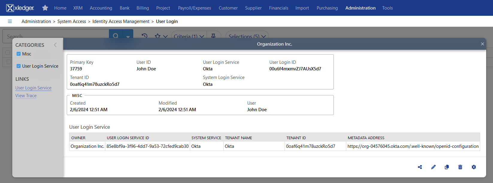

# Configure SSO between Xledger and Okta

## Contents

- Supported features
- Requirements
- Configuration steps

## Supported features

- Single Sign-On (OpenID Connect) initiated via Okta
- Provisioning or manual

## Configuration steps
We need to set up the User Login Service in Xledger based on some information from Okta.

1. In Applications > Applications, click Browse App Catalog and search for Xledger. Add the integration.

2. In Xledger go to **Administration > System Access > Identity Access Management > User Login Service**. Create a new row. Select "Okta" as the system login service and enter a tenant name of your choice. Enter the information from Okta as described below.

    1. In the Sign-On tab in Okta, copy the client ID and client secret, and, in Xledger, enter them as the tenent ID and tenant secret, respectively: \
    
    
    2. Get the metadata URL by copying the link from the sign-on tab as illustrated here, and enter it as the metadata address in Xledger: \
    

    3. Save the new row. Copy the value in the user login service ID column for the next step.
    

3. Fill out advanced sign-on settings in Okta: \
 \
Choose environment "Production" or "Demo" (Demo can be selected for customers with access to our demo environment that wish to test the solution first). Right below, paste the user login service ID obtained in the previous step.

4. For new users created by provisioning step 5 can be skipped (user login is created automatically if User Login Service is set up).

5. To be able to log in to Xledger with Okta, a mapping between the user in Okta and the user in Xledger must be set up in **Administration > System Access > Identity Access Management > User Login**. Create a new row with the user ID set to the appropriate Xledger user and the user login service set to the previously created user login service. The user login ID field must contain the user ID of the user in Okta. It can be obtained from the URL of the user profile in Okta. E.g. if the URL ends with /admin/user/profile/view/00u6f4mxmvZJ7AUsX5d7, then the user ID is 00u6f4mxmvZJ7AUsX5d7. \

Okta users assigned to the Xledger App should now be signed in by clicking the app under My Apps in Okta.
